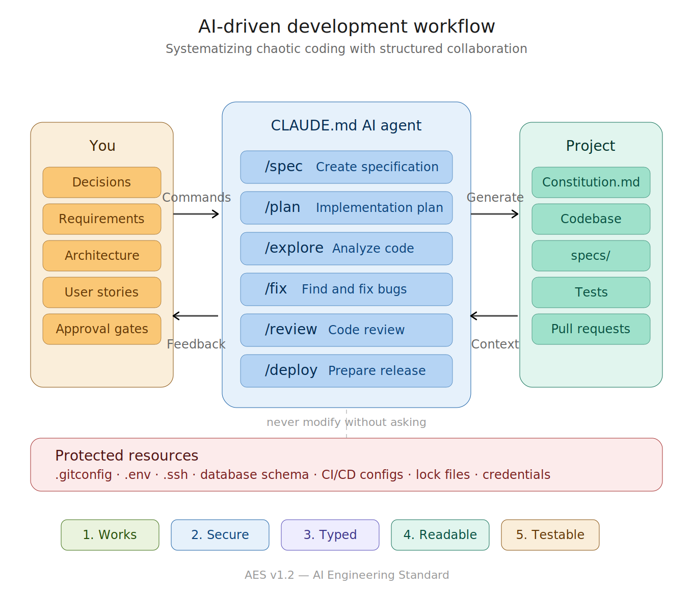

🌍 Languages:
[English](README.md) |
[Русский](README.ru.md)

AES Standard: v1.3
Execution Contract: CLAUDE.md
Compliance: L1

# 🧭 AI Engineering Standard (AES)

> **A standard for building software with AI agents.**

**AI Engineering Standard (AES)** is a structured methodology for human–AI collaboration in software development.

AES transforms AI from a code generator into a **predictable engineering partner**.

---

**From prompts → to engineering.**

---

## 📜 Required Contracts

AES requires two files:

* `PROJECT_CONSTITUTION.md` — defines WHAT is built
* `CLAUDE.md` — defines HOW AI builds it

Both contracts are required for AES compliance.

## 🌍 Why AI Development Needs a Standard

Modern AI-assisted development often leads to:

* architectural chaos
* context loss between sessions
* unpredictable regressions
* inconsistent implementations
* continuous rewrites

AES introduces **execution contracts, engineering rules, and operational boundaries**, making AI development controlled and scalable.

---

## 🧠 Core Principle

> AI executes decisions — it does not invent them.

Clear separation of responsibilities:

| Role | Responsibility |
| --- | --- |
| Human | Product vision, architecture, priorities |
| AI Agent | Analysis, implementation, validation |

---

## 🧩 AES Specification

AES consists of **two mandatory contracts**.

---

### 1️⃣ PROJECT_CONSTITUTION.md — Product Contract

Defines:

* project scope & non-goals
* architecture decisions
* technology stack
* domain model
* security boundaries
* deployment strategy
* definition of done

Answers:

➡️ **What are we building?**

---

### 2️⃣ CLAUDE.md — Execution Contract

Defines:

* AI agent role & boundaries
* development workflow (state machine)
* engineering constraints
* forbidden practices
* development priorities
* command system

Answers:

➡️ **How must AI build it?**

---

## ⚙️ Standard Agent Commands

| Command | Behavior |
| --- | --- |
| `/constitution` | Create project constitution |
| `/explore` | Analyze repository |
| `/spec` | Create feature specification |
| `/plan` | Generate implementation plan |
| `/status` | Show project status |
| `/fix` | Detect & fix errors |
| `/review` | Perform code review |
| `/deploy` | Prepare deployment |

AI **never starts implementation without an approved plan**.

---

## 🔄 AES Development Lifecycle

### Phase 1 — Discovery

* project analysis
* constitution creation
* context validation

### Phase 2 — Planning

* specification (spec.md)
* step-by-step execution plan (plan.md)
* risk identification
* human approval

### Phase 3 — Execution

* iterative implementation
* architectural compliance
* continuous validation

### Phase 4 — Delivery

* stability verification
* debug cleanup
* production readiness

---

## 🧱 Engineering Requirements

### Code Quality

* use typing available in the project's stack
* single responsibility per file
* new files: compact and focused
* meaningful naming

### Architecture

* layered separation
* dependency isolation
* configuration via environment variables

### Reliability

* guarded external calls
* graceful degradation
* structured logging
* failure recovery

### UX Baseline

* loading state
* empty state
* error state
* confirmation for destructive actions

---

## ⛔ AES Violations

❌ Suppression of type errors and linter rules
❌ Hardcoded configuration
❌ Secrets in source code (tokens, passwords, API keys)
❌ Debug logs in production
❌ Dead or commented code
❌ Empty catch blocks
❌ Logic duplication
❌ TODO without description
❌ Magic constants

---

## 🛡️ Protected Resources

AES defines a hard boundary around resources that agents must **never** modify without explicit request:

* System config — `.gitconfig`, `.ssh`, `.env`, shell profiles
* Database — schema changes, data modification, migrations by others
* Infrastructure — CI/CD, Docker, lock files, build configs
* Git — branch policies, hooks, remotes, user identity
* Credentials — API keys, tokens, vault configs, certificates

If a task indirectly requires changes to protected resources, the agent **stops and asks**.

---

## 🎯 Development Priorities

1. Works
2. Secure
3. Typed
4. Readable
5. Testable
6. Optimized

---

## ✅ AES Compliance Levels

| Level | Description | Required artifacts |
| --- | --- | --- |
| AES-L1 | Constitution defined | PROJECT_CONSTITUTION.md exists and filled |
| AES-L2 | Specification exists | specs/ contains ≥1 approved spec with plan |
| AES-L3 | Architecture enforced | CLAUDE.md configured, 0 violations in last PR |
| AES-L4 | Production Ready | CI checks AES violations automatically |

Projects may declare:

```
AES: L3 Compliant
```

---

## 🚀 Quick Start

```bash
cp PROJECT_CONSTITUTION.template.md your-project/PROJECT_CONSTITUTION.md
cp CLAUDE.md your-project/
```

1. Define project constitution
2. Establish execution context
3. Start your AI agent

---

## 🔗 Works With

**AI Coding Agents:**

* Claude Code
* Cursor
* GitHub Copilot
* Kilo Code
* opencode
* Qwen Code
* Local LLM agents
* Any agent that reads markdown context files

**Spec-Driven Development tools:**

* [GitHub Spec Kit](https://github.github.io/spec-kit/) — AES constitution maps to Spec Kit's `/speckit.constitution`, plans to `/speckit.plan`
* Any SDD workflow

**Suitable for:**

* frontend & backend
* mobile
* ML systems
* DevOps
* any language, any stack

---

## 🧭 Philosophy

> Humans design systems. AI executes them.

AES formalizes this boundary.

---

## 📝 Changelog

### v1.3 (2026-05-28)

* Introduced **Acceptance Floor** (§3.2) as a named invariant — the REVIEW → DEPLOYMENT transition is gated by an explicit act of human acceptance, never removed by maturity, complexity, or passing verification.
* **Verification-first**: Agent **MUST** declare its verification approach in PLANNING (and **MUST** cover any defined acceptance criteria) and execute it in REVIEW. Self-review, verification execution, and acceptance are now three distinct activities in REVIEW.
* **Stack-agnostic integrity check**: EXECUTION → REVIEW gate now reads "the project's defined integrity check passes" instead of "no compilation/build errors".
* **Operational mechanisms** (branching, merge, release gating) anchor in §3.2 — they *express* acceptance but do not substitute for the invariant.
* PLANNING gate is **partially compressible** (plan/spec formality scales with project maturity); verification declaration is not.
* Explicit compressibility framing across §4 makes the gate hierarchy unambiguous: which transitions can be simplified, which cannot.

### v1.2 (2026-05)

* Language-agnostic: removed TypeScript-specific rules, works with any stack
* Removed hard 150 LOC file limit — replaced with "compact and focused" principle
* Added secrets prohibition to Forbidden Practices
* Added Protected Resources section — hard boundaries around system config, database, git, credentials
* Clarified state transitions with artifact gates (spec.md, plan.md)
* Added `/spec` command
* Added `/constitution --quick` mode
* Compliance levels now tied to verifiable artifacts
* UX states upgraded from SHOULD to MUST (loading, empty, error)
* Added Agent Boundaries section (what agent must not do)
* Added Security section to constitution template
* Removed redundant sections: Communication Semantics (self-evident), Project Context (duplicate of constitution)

### v1.1 (2026-02)

* Initial RFC-grade specification

### v1.0 (2026-02)

* First release

---

## 📄 License

MIT — use, adapt, extend.

---

**⭐ If AES improves your workflow — consider starring the repository.**
